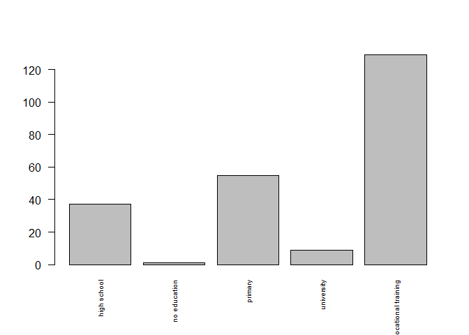

Answering questions about citizens in 2005 using data
================
Michał Wójcik

### Czy wielkość rodziny jest powiązana z wykształceniem głowy rodziny

``` r
data <- read.csv('budzety2005.csv')
summary(data)
```

    ##        X              hhno               famno           persno     
    ##  Min.   :    1   Min.   :100010111   Min.   :1.000   Min.   :1.000  
    ##  1st Qu.: 7502   1st Qu.:112000421   1st Qu.:1.000   1st Qu.:1.000  
    ##  Median :15002   Median :200431221   Median :1.000   Median :2.000  
    ##  Mean   :15002   Mean   :165772914   Mean   :1.161   Mean   :2.007  
    ##  3rd Qu.:22503   3rd Qu.:212550221   3rd Qu.:1.000   3rd Qu.:3.000  
    ##  Max.   :30003   Max.   :223271211   Max.   :5.000   Max.   :8.000  
    ##                                                                     
    ##    reltohoh              hoh           reltohof             hofam       
    ##  Length:30003       Min.   :0.0000   Length:30003       Min.   :0.0000  
    ##  Class :character   1st Qu.:0.0000   Class :character   1st Qu.:0.0000  
    ##  Mode  :character   Median :0.0000   Mode  :character   Median :1.0000  
    ##                     Mean   :0.4248                      Mean   :0.5412  
    ##                     3rd Qu.:1.0000                      3rd Qu.:1.0000  
    ##                     Max.   :1.0000                      Max.   :1.0000  
    ##                                                                         
    ##     month_hh       townsize          wojregion            farmsize       
    ##  Min.   : 1.00   Length:30003       Length:30003       Min.   :  0.0000  
    ##  1st Qu.: 4.00   Class :character   Class :character   1st Qu.:  0.0000  
    ##  Median : 7.00   Mode  :character   Mode  :character   Median :  0.0000  
    ##  Mean   : 6.54                                         Mean   :  0.7011  
    ##  3rd Qu.:10.00                                         3rd Qu.:  0.0000  
    ##  Max.   :12.00                                         Max.   :144.7800  
    ##                                                                          
    ##     farmnoeq         buildtype            flatsize          bills       
    ##  Min.   :  0.0000   Length:30003       Min.   :  0.00   Min.   :   0.0  
    ##  1st Qu.:  0.0000   Class :character   1st Qu.: 45.00   1st Qu.: 153.1  
    ##  Median :  0.0000   Mode  :character   Median : 59.00   Median : 281.7  
    ##  Mean   :  0.0744                      Mean   : 68.48   Mean   : 321.6  
    ##  3rd Qu.:  0.0000                      3rd Qu.: 80.00   3rd Qu.: 427.7  
    ##  Max.   :123.9000                      Max.   :400.00   Max.   :3783.0  
    ##                                                                         
    ##    weightYint    weightPers      OECDeqsH        OECDeqsF    
    ##  Min.   :215   Min.   : 445   Min.   :1.000   Min.   :1.000  
    ##  1st Qu.:344   1st Qu.: 714   1st Qu.:1.500   1st Qu.:1.000  
    ##  Median :366   Median :1012   Median :1.800   Median :1.500  
    ##  Mean   :377   Mean   :1064   Mean   :1.898   Mean   :1.627  
    ##  3rd Qu.:387   3rd Qu.:1408   3rd Qu.:2.300   3rd Qu.:2.000  
    ##  Max.   :888   Max.   :3440   Max.   :4.300   Max.   :4.100  
    ##                                                              
    ##   eq_GUSincome      eq_DATAincome       totincGUS        totexpGUS      
    ##  Min.   :-46471.2   Min.   :    0.0   Min.   :-83648   Min.   :  104.4  
    ##  1st Qu.:   749.9   1st Qu.:  664.2   1st Qu.:  1302   1st Qu.: 1182.2  
    ##  Median :  1057.7   Median :  996.9   Median :  1931   Median : 1714.9  
    ##  Mean   :  1238.3   Mean   : 1171.2   Mean   :  2277   Mean   : 2068.3  
    ##  3rd Qu.:  1495.2   3rd Qu.: 1440.0   3rd Qu.:  2800   3rd Qu.: 2501.2  
    ##  Max.   : 42100.0   Max.   :29294.4   Max.   : 85344   Max.   :28007.5  
    ##                                                                         
    ##   totinc_data      totinc_data_hh   mainincHH             numpHH     
    ##  Min.   : -500.0   Min.   :    0   Length:30003       Min.   :1.000  
    ##  1st Qu.:    0.0   1st Qu.: 1140   Class :character   1st Qu.:2.000  
    ##  Median :  650.0   Median : 1805   Mode  :character   Median :3.000  
    ##  Mean   :  808.5   Mean   : 2176                      Mean   :3.015  
    ##  3rd Qu.: 1119.7   3rd Qu.: 2704                      3rd Qu.:4.000  
    ##  Max.   :41800.0   Max.   :43942                      Max.   :8.000  
    ##                                                                      
    ##    ageofhead      numpFAM         numchfam        ageyoung        famtype     
    ##  Min.   : 15   Min.   :1.000   Min.   :0.000   Min.   : 0.00   Min.   :1.000  
    ##  1st Qu.: 39   1st Qu.:1.000   1st Qu.:0.000   1st Qu.: 5.00   1st Qu.:3.000  
    ##  Median : 50   Median :2.000   Median :0.000   Median :10.00   Median :4.000  
    ##  Mean   : 50   Mean   :2.455   Mean   :0.802   Mean   :10.37   Mean   :3.458  
    ##  3rd Qu.: 60   3rd Qu.:3.000   3rd Qu.:1.000   3rd Qu.:16.00   3rd Qu.:4.000  
    ##  Max.   :100   Max.   :8.000   Max.   :6.000   Max.   :51.00   Max.   :6.000  
    ##                                                NA's   :15959                  
    ##      sex                 age            married          invalid      
    ##  Length:30003       Min.   :  0.00   Min.   :0.0000   Min.   :0.0000  
    ##  Class :character   1st Qu.: 23.00   1st Qu.:0.0000   1st Qu.:0.0000  
    ##  Mode  :character   Median : 44.00   Median :0.0000   Median :0.0000  
    ##                     Mean   : 41.36   Mean   :0.4817   Mean   :0.2843  
    ##                     3rd Qu.: 58.00   3rd Qu.:1.0000   3rd Qu.:0.0000  
    ##                     Max.   :100.00   Max.   :1.0000   Max.   :4.0000  
    ##                                                                       
    ##      educ               farmer           student        regunempl      
    ##  Length:30003       Min.   :0.00000   Min.   :0.000   Min.   :0.00000  
    ##  Class :character   1st Qu.:0.00000   1st Qu.:0.000   1st Qu.:0.00000  
    ##  Mode  :character   Median :0.00000   Median :0.000   Median :0.00000  
    ##                     Mean   :0.06793   Mean   :0.232   Mean   :0.06763  
    ##                     3rd Qu.:0.00000   3rd Qu.:0.000   3rd Qu.:0.00000  
    ##                     Max.   :1.00000   Max.   :2.000   Max.   :1.00000  
    ##                                                                        
    ##     empstat         ipermemp          itempemp           iselfemp       
    ##  Min.   :0.000   Min.   :    0.0   Min.   :    0.00   Min.   :     0.0  
    ##  1st Qu.:1.000   1st Qu.:    0.0   1st Qu.:    0.00   1st Qu.:     0.0  
    ##  Median :2.000   Median :    0.0   Median :    0.00   Median :     0.0  
    ##  Mean   :3.449   Mean   :  517.4   Mean   :   15.69   Mean   :   114.5  
    ##  3rd Qu.:6.000   3rd Qu.:  548.0   3rd Qu.:    0.00   3rd Qu.:     0.0  
    ##  Max.   :8.000   Max.   :43694.9   Max.   :31125.01   Max.   :131677.7  
    ##                                                                         
    ##     iretpens       idispens          iunempb            preret       
    ##  Min.   :   0   Min.   :   0.00   Min.   :   0.00   Min.   :0.00000  
    ##  1st Qu.:   0   1st Qu.:   0.00   1st Qu.:   0.00   1st Qu.:0.00000  
    ##  Median :   0   Median :   0.00   Median :   0.00   Median :0.00000  
    ##  Mean   : 274   Mean   :  55.35   Mean   :   6.63   Mean   :0.01916  
    ##  3rd Qu.:   0   3rd Qu.:   0.00   3rd Qu.:   0.00   3rd Qu.:0.00000  
    ##  Max.   :8366   Max.   :4991.00   Max.   :2134.39   Max.   :1.00000  
    ##                                                                      
    ##     careall          socpens           mthnojob        ifprmaint      
    ##  Min.   :0.0000   Min.   :  0.000   Min.   : 0.000   Min.   :   0.00  
    ##  1st Qu.:0.0000   1st Qu.:  0.000   1st Qu.: 0.000   1st Qu.:   0.00  
    ##  Median :0.0000   Median :  0.000   Median : 0.000   Median :   0.00  
    ##  Mean   :0.1203   Mean   :  1.972   Mean   : 1.112   Mean   :  10.61  
    ##  3rd Qu.:0.0000   3rd Qu.:  0.000   3rd Qu.: 0.000   3rd Qu.:   0.00  
    ##  Max.   :2.0000   Max.   :857.000   Max.   :84.000   Max.   :3200.00  
    ##                                     NA's   :4006                      
    ##    ifcapital             ifrent            ifmatern            ifrehab        
    ##  Min.   :   0.0000   Min.   :   0.000   Min.   :   0.0000   Min.   :   0.000  
    ##  1st Qu.:   0.0000   1st Qu.:   0.000   1st Qu.:   0.0000   1st Qu.:   0.000  
    ##  Median :   0.0000   Median :   0.000   Median :   0.0000   Median :   0.000  
    ##  Mean   :   0.6325   Mean   :   5.222   Mean   :   0.1988   Mean   :   2.372  
    ##  3rd Qu.:   0.0000   3rd Qu.:   0.000   3rd Qu.:   0.0000   3rd Qu.:   0.000  
    ##  Max.   :2928.4446   Max.   :4000.000   Max.   :1988.0000   Max.   :5679.012  
    ##                                                                               
    ##    iffampens          ifother           owntype             alimpaid       
    ##  Min.   :   0.00   Min.   :    0.00   Length:30003       Min.   :   0.000  
    ##  1st Qu.:   0.00   1st Qu.:    0.00   Class :character   1st Qu.:   0.000  
    ##  Median :   0.00   Median :    0.00   Mode  :character   Median :   0.000  
    ##  Mean   :  45.43   Mean   :   13.97                      Mean   :   1.708  
    ##  3rd Qu.:   0.00   3rd Qu.:    0.00                      3rd Qu.:   0.000  
    ##  Max.   :5940.00   Max.   :15055.83                      Max.   :1600.000  
    ##                                                                            
    ##     transout          mortgage           exfarm         emptype     
    ##  Min.   :   0.00   Min.   :   0.00   Min.   :    0   Min.   :0.000  
    ##  1st Qu.:   0.00   1st Qu.:   0.00   1st Qu.:    0   1st Qu.:0.000  
    ##  Median :   0.00   Median :   0.00   Median :    0   Median :0.000  
    ##  Mean   :  67.95   Mean   :  14.93   Mean   :  205   Mean   :0.519  
    ##  3rd Qu.:  42.99   3rd Qu.:   0.00   3rd Qu.:    0   3rd Qu.:1.000  
    ##  Max.   :8000.00   Max.   :6219.00   Max.   :19170   Max.   :2.000  
    ##                                                      NA's   :4006   
    ##      random             random1        
    ##  Min.   :0.0000031   Min.   :0.000156  
    ##  1st Qu.:0.1738282   1st Qu.:0.400592  
    ##  Median :0.3439706   Median :0.539429  
    ##  Mean   :0.3456209   Mean   :0.496856  
    ##  3rd Qu.:0.5181219   3rd Qu.:0.628362  
    ##  Max.   :0.6917575   Max.   :0.691758  
    ## 

``` r
library(dplyr)
```

    ## 
    ## Attaching package: 'dplyr'

    ## The following objects are masked from 'package:stats':
    ## 
    ##     filter, lag

    ## The following objects are masked from 'package:base':
    ## 
    ##     intersect, setdiff, setequal, union

``` r
library(ggplot2)

#Selecting data on big families

data_1 <- data %>%
          filter(numpHH >= 6) %>%
          select(hhno,reltohoh,numpHH,townsize,farmsize,buildtype,totincGUS,educ)

#Selecting data on heads of big families

headofbigfamily <- data_1 %>%
                   filter(reltohoh == " head ") %>%
                   select(hhno,numpHH,townsize,farmsize,buildtype,totincGUS,educ)

#Counting percentages of head's various types of education

hoh_educ <- headofbigfamily$educ
no_hoh_educ <- table(hoh_educ)
rev(sort(prop.table(no_hoh_educ)*100))
```

    ## hoh_educ
    ## vocational training             primary         high school          university 
    ##          55.8441558          23.8095238          16.0173160           3.8961039 
    ##        no education 
    ##           0.4329004

``` r
barplot(table(hoh_educ),las = 2,cex.names = 0.6)
```

<!-- -->

``` r
#Counting percentages of head's town size
hoh_townsize <- headofbigfamily$townsize
rev(sort(prop.table(table(hoh_townsize))*100))
```

    ## hoh_townsize
    ##          villages  20,000  - 99,999 town up to 19,999 200,000 - 499,999 
    ##         72.294372         12.121212          6.493506          3.463203 
    ##  500,000 and over 100,000 - 199,999 
    ##          3.030303          2.597403

``` r
#Counting percentages of head's build type
hoh_buildtype <- headofbigfamily$buildtype
rev(sort(prop.table(table(hoh_buildtype))*100))
```

    ## hoh_buildtype
    ## free standing    multi-flat  terrace/twin 
    ##     66.666667     25.541126      7.792208

Jak widać duże rodziny z wyższym wykształceniem założyło zaledwie 3,90%
osób. 72% dużych rodzin mieszka na wsi. 67% dużych rodzin mieszka w
wolno stojących budynkach.

### Czy głowy rodziny mieszkające w miastach którzy na czas upadku komunizmu mieli 21 - 35 lat są bardziej zamożne niż reszta społeczeństwa?

``` r
library(tidyverse)
```

    ## -- Attaching packages --------------------------------------- tidyverse 1.3.1 --

    ## v tibble  3.1.6     v purrr   0.3.4
    ## v tidyr   1.1.4     v stringr 1.4.0
    ## v readr   2.1.1     v forcats 0.5.1

    ## -- Conflicts ------------------------------------------ tidyverse_conflicts() --
    ## x dplyr::filter() masks stats::filter()
    ## x dplyr::lag()    masks stats::lag()

``` r
#Selecting people aged 21-35 in 1989 

data_2_1 <- data %>% 
          filter(reltohoh == " head ", ageofhead <=51, ageofhead >=37,
                 townsize != "villages") %>%
          select(wojregion,totinc_data,mainincHH,ageofhead) 
          
          
          
# 90th percentile of income of overall population irrespective of its source 

quantile_90 <- quantile(data$totinc_data, probs = .9)


# People with an income higher than 90% of society aged 21-35 in 1989

data_2_1_corrected_by_inc <- data_2_1 %>%
                           filter(totinc_data > quantile_90)

# Richest 10% divided by main source of income 

wynik_2_1 <- data_2_1_corrected_by_inc %>%
                        as_tibble() %>%
                        count(mainincHH)

nrow(data_2_1_corrected_by_inc)/nrow(data_2_1)
```

    ## [1] 0.2840449

``` r
# The rest

data_2_2_older <- data %>% 
          filter(reltohoh == " head ", ageofhead>51,
                 townsize != "villages") %>%
          select(wojregion,totinc_data,mainincHH,ageofhead) 
          
data_2_2_younger <- data %>% 
          filter(reltohoh == " head ", ageofhead <37, ageofhead >= 21,
                 townsize != "villages") %>%
          select(wojregion,totinc_data,mainincHH,ageofhead) 

data_2_2 <- rbind(data_2_2_older,data_2_2_younger)


#People with an income higher than 90% of society aged other (>21) than previous group

data_2_2_corrected_by_inc <- data_2_2 %>%
                           filter(totinc_data > quantile_90)

#Richest 10% divided by main source of income
wynik_2_2 <- data_2_2_corrected_by_inc %>%
                        as_tibble() %>%
                        count(mainincHH)

# Counting both populations
npop1 <- nrow(data_2_1)
npop2 <- nrow(data_2_2)

a1<- (wynik_2_1$n/npop1)*100
a2<- c("disability pens.","employee, manual","employee, non-manual", "farmer","from rent of house(flat), garage","nonfarm selfempl.","retirement pens.")

b1<- (wynik_2_2$n/npop2)*100
b2<- c("disability pens.","employee, manual","employee, non-manual", "farmer","from rent of house(flat), garage","nonfarm selfempl.","other social assistance","retirement pens.")

result_1 <-as.data.frame(a2)
result_1 <- cbind(result_1,a1)

result_2 <-as.data.frame(b2)
result_2 <- cbind(result_2,b1)
result_2 <- result_2 %>% slice(-c(7))

general_results <- cbind(result_1, result_2)
colnames(general_results) <- c("1st Group","Percentage","2nd Group","Percentage")

print.data.frame(general_results)
```

    ##                          1st Group Percentage                        2nd Group
    ## 1                 disability pens.  0.2696629                 disability pens.
    ## 2                 employee, manual  4.6292135                 employee, manual
    ## 3             employee, non-manual 15.5955056             employee, non-manual
    ## 4                           farmer  0.1348315                           farmer
    ## 5 from rent of house(flat), garage  0.1797753 from rent of house(flat), garage
    ## 6                nonfarm selfempl.  6.2022472                nonfarm selfempl.
    ## 7                 retirement pens.  1.3932584                 retirement pens.
    ##   Percentage
    ## 1  0.5591054
    ## 2  1.5335463
    ## 3  8.1150160
    ## 4  0.0798722
    ## 5  0.0798722
    ## 6  2.4281150
    ## 7  5.6230032

Ludzie w wieku 21 - 35 założyli 2,5 razy więcej firm które uplasowują
ich w top 10% najlepiej zarabiających głów rodzin wśród wszystkich grup
wiekowych niż reszta społeczeństwa.

10% najlepiej zarabiających z tej grupy stanowi 28% populacji swojej
grupy wiekowej podczas gdy 10% najlepiej zarabiających reszty stanowi
18% populacji swojej grupy wiekowej. Co krótko oznacza, że większy
odsetek ludzi z interesującej nas grupy osiągnął spory sukces.

### W którym województwie płaci się największe rachunki?

``` r
data <- read.csv('budzety2005.csv')
data_3 <- data %>%
          select(buildtype,wojregion,bills)

result_3 <- aggregate(data_3$bills ~ data_3$buildtype + data_3$wojregion, FUN=mean)
result_3
```

    ##    data_3$buildtype    data_3$wojregion data_3$bills
    ## 1     free standing        Dolnoslaskie    292.12637
    ## 2        multi-flat        Dolnoslaskie    335.14872
    ## 3             other        Dolnoslaskie    282.59000
    ## 4      terrace/twin        Dolnoslaskie    282.74674
    ## 5     free standing  Kujawsko-pomorskie    279.48854
    ## 6        multi-flat  Kujawsko-pomorskie    363.80750
    ## 7      terrace/twin  Kujawsko-pomorskie    308.59551
    ## 8     free standing             Lodzkie    253.56292
    ## 9        multi-flat             Lodzkie    339.26188
    ## 10            other             Lodzkie    381.87825
    ## 11     terrace/twin             Lodzkie    251.93268
    ## 12    free standing           Lubelskie    202.29361
    ## 13       multi-flat           Lubelskie    353.34219
    ## 14            other           Lubelskie    151.23778
    ## 15     terrace/twin           Lubelskie    298.95492
    ## 16    free standing            Lubuskie    287.51615
    ## 17       multi-flat            Lubuskie    355.93218
    ## 18            other            Lubuskie    857.91998
    ## 19     terrace/twin            Lubuskie    247.65698
    ## 20    free standing         Malopolskie    289.58702
    ## 21       multi-flat         Malopolskie    373.27413
    ## 22            other         Malopolskie    358.43166
    ## 23     terrace/twin         Malopolskie    338.49304
    ## 24    free standing         Mazowieckie    264.24992
    ## 25       multi-flat         Mazowieckie    399.10028
    ## 26            other         Mazowieckie     57.25538
    ## 27     terrace/twin         Mazowieckie    411.14207
    ## 28    free standing            Opolskie    330.53226
    ## 29       multi-flat            Opolskie    329.11589
    ## 30            other            Opolskie    488.38154
    ## 31     terrace/twin            Opolskie    278.11601
    ## 32    free standing        Podkarpackie    279.64929
    ## 33       multi-flat        Podkarpackie    361.93646
    ## 34            other        Podkarpackie    277.57333
    ## 35     terrace/twin        Podkarpackie    267.47262
    ## 36    free standing           Podlaskie    213.67507
    ## 37       multi-flat           Podlaskie    324.82127
    ## 38     terrace/twin           Podlaskie    299.04431
    ## 39    free standing           Pomorskie    357.91896
    ## 40       multi-flat           Pomorskie    324.62385
    ## 41            other           Pomorskie    341.75000
    ## 42     terrace/twin           Pomorskie    207.48911
    ## 43    free standing             Slaskie    292.65482
    ## 44       multi-flat             Slaskie    379.85323
    ## 45            other             Slaskie    229.11500
    ## 46     terrace/twin             Slaskie    291.54619
    ## 47    free standing      Swietokrzyskie    234.08326
    ## 48       multi-flat      Swietokrzyskie    314.87679
    ## 49            other      Swietokrzyskie    303.88000
    ## 50     terrace/twin      Swietokrzyskie    231.66611
    ## 51    free standing Warminsko-mazurskie    282.89179
    ## 52       multi-flat Warminsko-mazurskie    336.17480
    ## 53            other Warminsko-mazurskie    215.29765
    ## 54     terrace/twin Warminsko-mazurskie    261.77325
    ## 55    free standing       Wielkopolskie    313.21757
    ## 56       multi-flat       Wielkopolskie    364.01366
    ## 57            other       Wielkopolskie    392.00000
    ## 58     terrace/twin       Wielkopolskie    321.18937
    ## 59    free standing  Zachodniopomorskie    242.60721
    ## 60       multi-flat  Zachodniopomorskie    324.49177
    ## 61     terrace/twin  Zachodniopomorskie    287.05813

``` r
top_n(result_3[3],3)
```

    ## Selecting by data_3$bills

    ##   data_3$bills
    ## 1     857.9200
    ## 2     411.1421
    ## 3     488.3815

Najwieksze rachunki placi sie za inny typ domu w Lubuskim, potem inny
typ w Opolskim, a jako trzecie uplasowal sie typ domu blizniak w woj.
Mazowieckim
